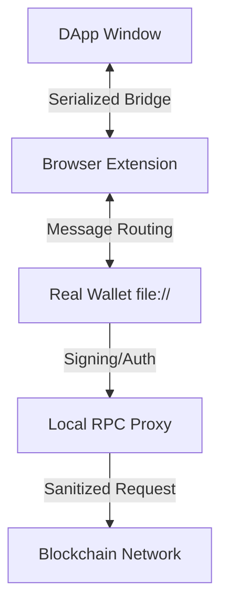
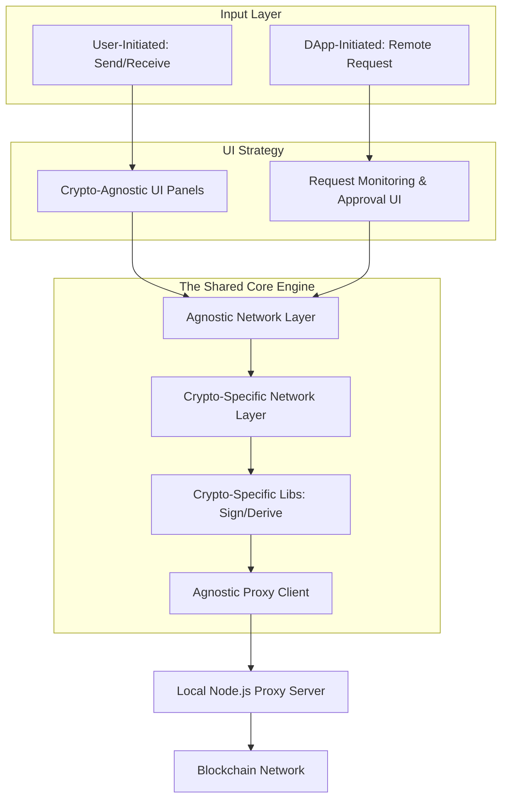

# All My Money Bags (AMMB)
### **The Zero-Trust, Local-First, Multi-Chain Crypto Ecosystem**

> **Project Status:** Private Source / Active Development
> **Architecture:** Multi-Process Isolation (Node.js + WebExtensions + Native Browser)
> **Target OS:** Linux (Hardened Environment)

---

## 🛡️ The Philosophy: "Zero-Third-Party" Security
Most modern web wallets are vulnerable to **supply-chain attacks** via CDNs, compromised NPM packages, or malicious browser extension updates. **All My Money Bags** was architected to eliminate these attack vectors by moving the entire wallet logic into a standalone, local execution environment.

### Key Innovations:
* **No CDNs / No External Runtimes:** All libraries are local. No code is ever fetched from a third-party server during execution.
* **Process Isolation:** The wallet UI runs as a restricted `file://` resource, physically and logically separated from the dApp's DOM.
* **Transient Secret Handshake:** A custom security protocol ensures that only the instances spawned by the AMMB Lifecycle Manager can communicate with the RPC Proxy.

---

## 🏗️ System Architecture
The system is composed of four distinct layers working in orchestration to ensure maximum security and user agency:

1.  **The Lifecycle Manager (Node.js):** The "Controller" that spawns a hardened browser instance with a unique, one-time execution profile and a transient security secret.
2.  **The Real Wallet (HTML5/ES6):** The "Boss." A high-security UI loaded via `file://`. It holds the keys, manages derivation (BIP-32/44), and signs transactions.
3.  **The Messaging Bridge (Browser Extension):** A Manifest V3 implementation that acts as a serialized gateway between untrusted dApps and the Real Wallet.
4.  **The RPC Proxy Server (Node.js):** A local gateway for blockchain communication. It handles provider failover, tracks endpoint reliability (latency/errors), and sanitizes all outgoing requests.

---

## ⛓️ Supported Protocols
AMMB features a **Chain-Agnostic Networking Layer**, allowing for rapid integration of diverse protocols:
* **EVM Chains:** Ethereum (ETH), BSC, Polygon (POL).
* **UTXO & Legacy:** Bitcoin (BTC), Ripple (XRP), Stellar (XLM).
* **Tokens:** Integrated support for ERC20 and BEP20 standards.

---

## 🤖 AI Orchestration & Engineering Role
This project serves as a case study in **AI-Accelerated Systems Engineering**.
* **Role:** Architect, Senior Reviewer, and Lead Integrator.
* **Process:** Directed Large Language Models (LLMs) to generate ~90% of the functional code while maintaining strict oversight of security patterns, memory management, and architectural integrity.
* **Validation:** Performed 100% manual audit of AI-generated logic to ensure "Zero-Third-Party" compliance and cryptographic correctness.

---

## 🛠️ Technical Stack
* **Languages:** Vanilla JavaScript (ES6+), Node.js.
* **Environment:** Linux (Bash), Browser Extensions (MV3).
* **Crypto:** Custom implementations/integrations for Signing, Derivation, and RPC communication.

---

## 🖥️ Application Screenshots
Due to the proprietary nature of the security architecture and the "Local-First" design, the source code is currently maintained in a private repository.

---

## 📬 Contact for Demo
Due to the proprietary nature of the security architecture and the "Local-First" design, the source code is currently maintained in a private repository.

**For a technical walkthrough, architecture review, or a live demonstration on a Linux environment, please reach out via my contact information on my profile.**
